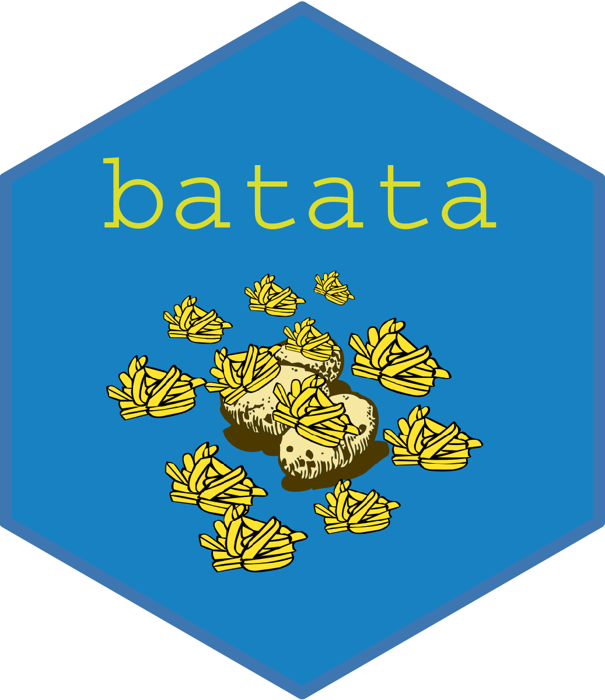

<!-- README.md is generated from README.Rmd. Please edit that file -->

# batata <a></a>

<!-- badges: start -->

[](https://cran.r-project.org/package=batata)
[](https://cran.r-project.org/package=batata)
[](https://cran.r-project.org/package=batata)
[](https://cran.r-project.org/package=batata)
[](https://choosealicense.com/licenses/mit/)
[](https://github.com/feddelegrand7/batata)
[](https://github.com/feddelegrand7/batata/actions)
<!-- badges: end -->

`batata` is A Toolbox for Managing R Packages Installation and Removal.

## Installation

You can install the `batata` package from CRAN with:

``` r
install.packages("batata")
```

Install the development version of `batata` from Github with:

``` r
install.packages("remotes") # if not installed

remotes::install_github("feddelegrand7/batata")
```

<!-- For example, imagine you're attending tomorrow an R meet up in which you'll experiment many packages that you don't want to keep. By the end of the meet up, you'll have to remember each installed package, its name (trust me, packages' names may be complicated). Further, each installed package might come with a bunch of dependencies which makes the operations more complicated. Using the batata package, you can just run `rm_today_packages()` (one of many other functions), and you're clean for today. Before removing the packages, batata will prompt you to confirm your decision (which adds a certain degree of security), you can also run `today_packages()` to check all the today installed packages before making a decision.  -->
<!-- `batata` takes into account the __modification time__ of the packages instead of the __birth time__. As such, if you decide to update a package to a newer version, `batata` will consider it as a new package (which is technically true as a new package will be installed).  -->

## Documentation

The documentation is available [here](https://batata-doc.netlify.app/)

## Aknowledgement

Concerning the **packages installation** part of `batata` I was mainly
inspired by the tweet of [Tim
Tiefenbach](https://twitter.com/TimTeaFan/status/1352007510425817089),
so a big thanks to him !

------------------------------------------------------------------------

## Code of Conduct

Please note that the batata project is released with a [Contributor Code
of
Conduct](https://contributor-covenant.org/version/2/0/CODE_OF_CONDUCT.html).
By contributing to this project, you agree to abide by its terms. If you
encounter any bug or if you want an improvement, please feel free to
open an Issue.
